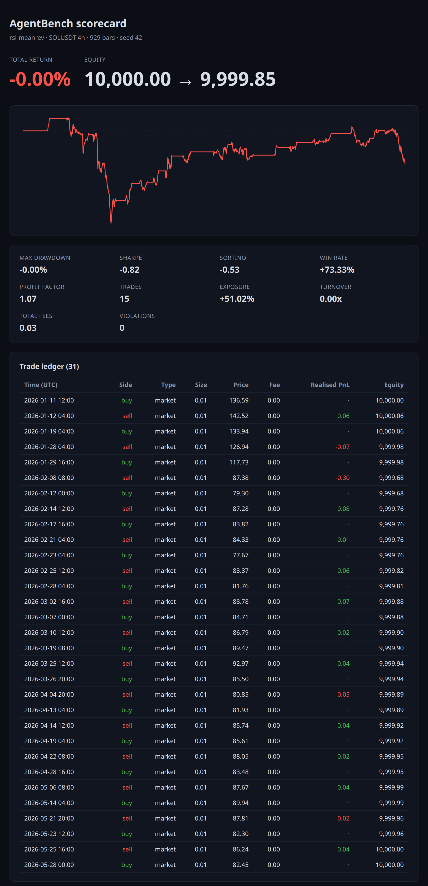

<p align="center">
  
</p>

<p align="center">
  <a href="https://www.npmjs.com/package/bitget-agentbench"></a>
  <a href="https://github.com/zkasuran/bitget-agentbench/actions/workflows/ci.yml"></a>
  
</p>

# bitget-agentbench

Backtest, score and **verify** Bitget trading agents on real candle data. Point it
at any strategy and it gives you back a scorecard a stranger can re-run and check,
with zero API keys and zero real money.

A scorecard you cannot check is a screenshot. AgentBench emits a scorecard anyone
can re-derive: `agentbench verify` recomputes every number from the trade ledger
and re-runs the strategy from the manifest, so a result is something you confirm,
not something you trust.

Built for the [Bitget Agent Hub](https://github.com/BitgetLimited/agent_hub)
ecosystem. If you are building a trading agent, this is the harness that proves it
works and proves it to someone else, before it touches a live account.

## Why this exists

Agent Hub lets an agent read the market and place trades. It does not tell you
whether the agent is any good and it gives you no artifact you can hand someone
to say "here is what my agent did, check it yourself". So every team rolls its
own evidence, badly or trades live to get it. Both are bad options.

AgentBench fills that gap and closes it with verification:

- **Backtest** any strategy against real Bitget candles, bar by bar, no lookahead.
- **Risk-guard** it with hard limits (max position, max leverage, drawdown
  kill-switch) so a runaway agent stops instead of blowing up.
- **Score** it: return, max drawdown, Sharpe, Sortino, win rate, profit factor,
  exposure, fees, turnover.
- **Verify** it: every run emits a `scorecard.json` with a content hash, a
  `trades.jsonl` ledger and a manifest with the dataset hash. `agentbench verify`
  re-derives the whole claim and prints PASS or FAIL. Re-running a doctored
  scorecard fails, even if the forger re-stamps the hash.

## Install

```bash
npm install bitget-agentbench
```

## Quickstart (no keys, no network)

The package ships with real Bitget candle fixtures, so you can run a full backtest
the moment it is installed.

```bash
npx agentbench run --strategy sma-crossover --symbol BTCUSDT --tf 4h --seed 42 --out ./report
npx agentbench verify ./report
```

Built-in strategies are `sma-crossover` and `rsi-meanrev`. To score your own
agent, point `--agent` at a file that exports a default `{ onBar(bar, ctx) }`
(see below).

The run prints a summary and writes a `report/` folder with `scorecard.json`,
`trades.jsonl`, `equity.csv`, `manifest.json` and a self-contained `scorecard.html`:



Every number is computed from real Bitget candles and reproduces from the seed.

## Verify: do not trust the scorecard, check it

Prefer to see it before installing anything? The committed reports verify
**in your browser**, no server and no setup, at
**https://zkasuran.github.io/bitget-agentbench/**. It runs the real verifier
client-side and lets you doctor a number and watch the verdict flip to FAIL.

This is the part that matters. `agentbench verify <report-dir | scorecard.json>`
runs four independent checks and exits non-zero if any fails:

```
$ npx agentbench verify ./report

Verifying ./report/scorecard.json
Agent:    rsi-meanrev

  [PASS] integrity content hash matches (598ce9fb138bdd08…)
  [PASS] dataset   930 candles re-hash to the claimed dataset SHA256 (3476016e55d868ed…)
  [PASS] ledger    all 12 headline metrics recompute from 29 fills + the equity curve
  [PASS] replay    re-running rsi-meanrev from the manifest reproduces every metric

VERIFIED. The numbers were recomputed from the ledger and they match
```

- **integrity** recomputes the scorecard content hash and asserts it matches.
  Catches any edit to `scorecard.json`.
- **dataset** reloads the candles named in the manifest, recomputes their SHA256
  and asserts it matches. Catches swapped or doctored candles.
- **ledger** recomputes every headline metric straight from `equity.csv` and
  `trades.jsonl`, reconstructing position and exposure from the fills themselves,
  and asserts it matches the claim. Catches numbers that do not follow from the
  trades.
- **replay** re-runs the strategy from the manifest's own config and seed and
  asserts the metrics reproduce. The strongest check. It runs built-in strategies
  automatically. To replay your own strategy, point it at the agent file:

```bash
npx agentbench verify ./report --agent ./my-agent.ts
```

`run --agent` also snapshots your strategy into the report as `agent.snapshot.*`,
so `verify ./report --replay-embedded` can re-run it from the report alone. Replay
covers any strategy this way, not just the built-ins.

Verify never executes code from a report on its own. It runs the built-ins
(its own code). It runs an external agent only when you pass it with `--agent`,
or the embedded snapshot only when you opt in with `--replay-embedded`. Without
one of those, replay skips and the verdict rests on integrity, dataset and ledger.

The content hash alone only proves a file was not edited. A forger could edit a
number and re-stamp the hash. They cannot beat **ledger** and **replay**, which
recompute the numbers from scratch. That layering is the point.

## Integrate your own agent in 5 lines

A strategy is one method. Return the orders to place on each bar or an empty
array to do nothing.

```ts
import type { StrategyAgent } from "bitget-agentbench";

const agent: StrategyAgent = {
  name: "buy-the-dip",
  onBar(bar, ctx) {
    if (ctx.position.size === 0 && bar.close < bar.open * 0.98)
      return [{ symbol: "BTCUSDT", side: "buy", orderType: "market", size: 0.01 }];
    return [];
  },
};

export default agent;
```

Run it: `npx agentbench run --agent ./buy-the-dip.ts --symbol BTCUSDT --tf 4h`.

## Already built an Agent Hub agent? Drop it in

Agent Hub agents place trades by calling `spot_place_order` with
`{ symbol, side, orderType, price, size }`. That is exactly AgentBench's order
shape, so an agent you already wrote does not need a rewrite. Wrap its per-bar
decision with `fromAgentHub`:

```ts
import { fromAgentHub } from "bitget-agentbench";
import type { AgentHubOrder, Bar, BarContext } from "bitget-agentbench";

function decide(bar: Bar, ctx: BarContext): AgentHubOrder[] {
  // the same spot_place_order calls your Agent Hub agent already makes
  if (ctx.position.size === 0 && bar.close > someSignal)
    return [{ symbol: "BTCUSDT", side: "buy", orderType: "market", size: 0.01 }];
  return [];
}

export default fromAgentHub("my-hub-agent", decide);
```

A complete, runnable version is in `examples/agent-hub-adapter.ts`:

```bash
npx agentbench run --agent examples/agent-hub-adapter.ts --symbol BTCUSDT --tf 4h --seed 42 --out ./report
npx agentbench verify ./report
```

## Use it as a library

```ts
import { runBacktest, loadFixture, verifyReport, VERSION } from "bitget-agentbench";

const bars = loadFixture("BTCUSDT", "4h");
const { scorecard, fills } = await runBacktest({
  agent,
  bars,
  config: { startingEquity: 10_000, feeBps: 10, slippageBps: 1, seed: 42 },
  risk: { maxDrawdownKill: 0.3, maxPositionSize: 1 },
  manifest: {
    agentbenchVersion: VERSION, symbol: "BTCUSDT", granularity: "4h",
    source: "fixture", bars: bars.length,
    firstBarTime: bars[0].time, lastBarTime: bars[bars.length - 1].time,
    datasetSha256: "fixture",
  },
});

console.log(scorecard.metrics);
const result = await verifyReport("./report"); // { pass, checks: [...] }
```

## MCP: let an agent backtest and grade itself

AgentBench ships an MCP server, so an agent running in Claude, Cursor or any MCP
client can score and check a strategy without leaving its tool loop. It slots
right next to the official Bitget Agent Hub MCP server.

Add it to Claude Code:

```bash
claude mcp add -s user agentbench -- npx -y -p bitget-agentbench agentbench-mcp
```

Or wire it manually (Cursor, Claude Desktop, etc.):

```json
{
  "mcpServers": {
    "agentbench": { "command": "npx", "args": ["-y", "-p", "bitget-agentbench", "agentbench-mcp"] }
  }
}
```

It exposes two tools, deterministic and credential-free:

- `agentbench_run({ strategy, symbol, granularity, seed, outDir? })` backtests a
  built-in strategy and returns the scorecard. Pass `outDir` to persist the full
  report so the run leaves verifiable artifacts.
- `agentbench_verify({ target })` runs the four checks above against a report
  directory or scorecard. This is the "agents grading agents" path: one agent
  produces a claim, another checks it.

## Verify in CI

A scorecard in a repo should fail the build if its numbers stop reproducing. Drop
the `verified-by-agentbench` action into a workflow:

```yaml
- uses: zkasuran/bitget-agentbench@v0.4.0
  with:
    report: ./report   # a report dir or scorecard.json committed in your repo
```

It runs `agentbench verify` and the job goes red if integrity, dataset, ledger or
replay fail. This repo dogfoods it: every report under `reports/` is verified on
every push, so the badge above means the committed numbers still reproduce.

## Live candles

By default AgentBench runs on committed fixtures: zero network, fully
reproducible. To score against fresh data, add `--source live`:

```bash
npx agentbench run --strategy rsi-meanrev --symbol BTCUSDT --tf 4h --source live --limit 500 --out ./report
npx agentbench verify ./report
```

It pulls candles from Bitget's public spot endpoint (keyless, read-only) and
snapshots the exact candles it used into `report/candles.json`. The run records
`source: "candles"`. Verify then re-derives the dataset hash, recomputes the
ledger and replays the strategy against that snapshot, so a live run stays
checkable: the data changes between fetches, but the result you publish does not.
Fixtures remain the default, because determinism is the point.

## RiskGuard

Every order passes through a policy gate before it can fill. Set only the limits
you care about; the rest are not enforced.

```ts
const risk = {
  maxOrderSize: 0.1,       // base units per order
  maxPositionSize: 1.0,    // net position cap
  maxNotional: 50_000,     // quote per order
  maxLeverage: 3,          // gross notional / equity
  symbolAllowlist: ["BTCUSDT", "ETHUSDT"],
  maxDrawdownKill: 0.2,    // halt the run at 20% drawdown
  maxDailyLoss: 500,       // halt at 500 quote realised loss in a UTC day
};
```

Rejected orders and kill events are recorded in the scorecard, so you can see
exactly when and why the guard stepped in.

## The fill model

Conservative and no-lookahead, so a backtest does not flatter the strategy:

- The agent sees a closed bar and decides. Orders execute against the **next**
  bar.
- Market orders fill at the next bar's open, with slippage moving the price
  against you.
- Limit buys fill at the limit price when the next bar's low reaches it. Limit
  sells fill when the high reaches it.
- Fees use Bitget's standard spot rate of 0.1% (verified against Bitget Academy,
  June 2026). Override `feeBps` for your own tier.

This is a long-only spot engine. Short positions and futures funding are out of
scope for this release, named on purpose rather than half-built. A sell larger
than your position is clamped to what you hold, never silently turned into a short.

Candles come from a committed fixture by default or live from Bitget's public
keyless endpoint with `--source live` (see Live candles above).

## Reproducibility

The manifest records the dataset hash, symbol, timeframe, engine config and seed.
Same inputs in, same scorecard out, byte for byte. The scorecard also carries a
content hash over its own `{agent, metrics, manifest}`. This is a content hash,
not a cryptographic signature: it proves the file was not altered after emission,
and `agentbench verify` does the rest by recomputing the numbers independently.

## Security

This package depends only on `bitget-core`, the official MCP SDK and `zod`. It has
no `postinstall` script and ships a `guard:deps` check that fails the build if any
unexpected package enters the dependency tree. Nothing here touches your shell,
your global config or your credentials.

## Development

```bash
npm install
npm run build
npm test          # 86 tests: simulator, metrics, fixtures, candle source, hash, verify, replay, adapter, cli, mcp
npm run typecheck
npm run guard:deps
```

## Verification done

Every financial formula is reviewed and the whole suite is verified locally before
release: 86 passing tests, a clean type-check, end-to-end runs that reproduce
byte-identical scorecards from a fixed seed and `agentbench verify` passing on
every committed report and on a live-fetched run. The fill model, fee rate and
metric formulas are documented above so they can be checked rather than trusted.

## License

MIT
